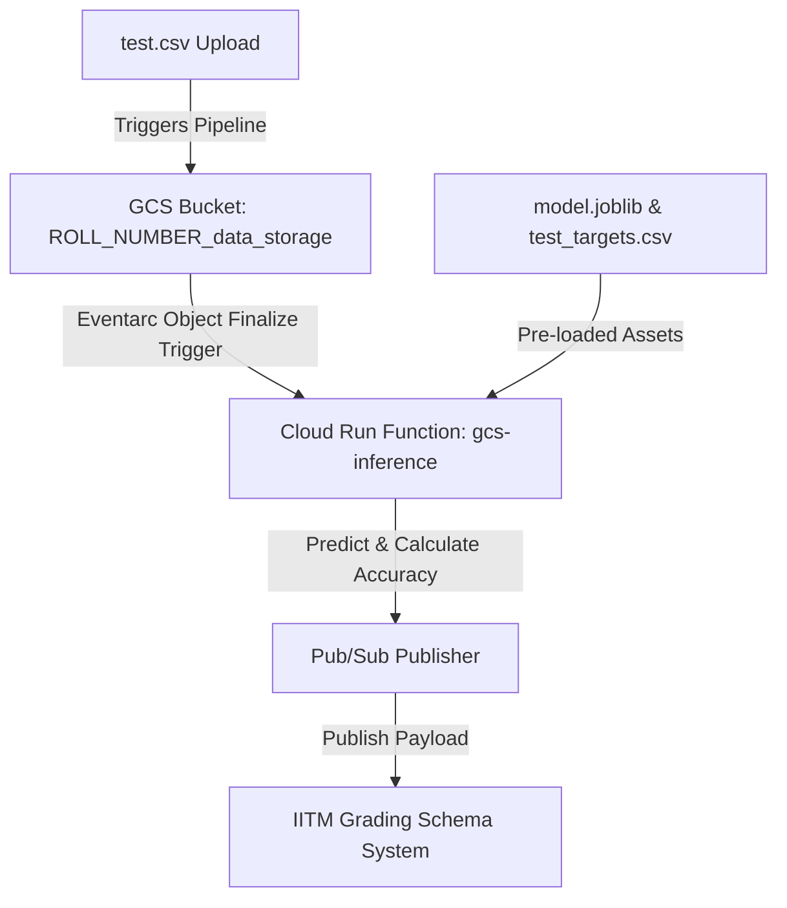

# 🎓 IITM GCP Day 2 ML Pipeline Workshop Helper

An interactive, high-fidelity 3D helper portal built with **Next.js (App Router)**, **TypeScript**, and **Three.js** to help IITM students seamlessly deploy and troubleshoot their Day 2 Machine Learning pipelines on Google Cloud Platform.

🔗 **Live Deployed Website:** [https://iitm-workshop.vercel.app/](https://iitm-workshop.vercel.app/)

---

## 🚀 Key Features

*   **Dynamic Code Generator:** Automatically compiles fully-compliant, custom-tailored `main.py` and `requirements.txt` files injected with your specific student Roll Number in real-time.
*   **One-Click Asset Downloads:** Download generated `main.py`, `requirements.txt`, and the standard `test.csv` workshop dataset instantly.
*   **Interactive 3D Network Canvas:** Embedded responsive **Three.js** wireframe cloud nodes, orbiting server nodes, and flying Eventarc data packets that track mouse movements and hover states.
*   **Comprehensive Setup Walkthrough:** Visual step-by-step progress tracking through the GCP Storage Bucket, Cloud Run Functions, Eventarc Triggers, and Pub/Sub publisher flows.
*   **Student Sandbox Troubleshooter:** Real-time fixes for common sandboxed environment restrictions.

---

## 🛠️ GCP Day 2 ML Pipeline Architecture

The workshop pipeline is structured as follows:



1.  **Cloud Storage Bucket:** Staged in `us-central1` with the exact naming structure `<ROLL_NUMBER>_data_storage`.
2.  **Helper Assets:** `model.joblib` and `test_targets.csv` pre-loaded in the GCS bucket.
3.  **Cloud Run Function (`gcs-inference`):** Python 3.12 function running in `us-central1` that downloads `test.csv` on upload, performs model inference using the pre-loaded model, calculates accuracy against `test_targets.csv`, and publishes a Pub/Sub payload.
4.  **IITM Grading Bot:** Listens for the Pub/Sub payload and triggers a G-Space Chat verification message.

---

## ⚠️ Sandboxed Student Environment Troubleshooting (Crucial)

If you or your friends are facing issues, review these common roadblocks and their fixes:

### 1. Why G-Space Verification is Not Received (Case-Sensitivity Issue)
*   **Problem:** The automated IITM grading system is strictly **case-sensitive** for roll numbers. If your bucket name, Cloud Run configuration, or Pub/Sub payload uses a lowercase 'f' (e.g. `25f3001012`), the grading bot fails silently and ignores the submission.
*   **Fix:** Ensure you always use an uppercase **`F`** (e.g. `25F3001012`) across your configurations and payloads. Re-deploying and re-uploading `test.csv` with the uppercase roll number will trigger the bot verification.

### 2. Quota Exceeded / Failed to Initialize Region Error
*   **Problem:** In the student-sandboxed Google Cloud environment, resource allocations are restricted exclusively to the **`us-central1` (Iowa)** region. Trying to deploy in other regions (such as `us-east1` or `europe-west3`) will fail immediately with a `Project failed to initialize in this region due to quota exceeded` error.
*   **Fix:** Recreate the Cloud Storage Bucket and the Cloud Run Function, ensuring that you manually set the region configuration to **`us-central1`**.

### 3. Pub/Sub Message Schema Validation Failure
*   **Problem:** The grading schema server expects accuracy to be formatted strictly as a string (e.g., `"0.55"`), and will throw a validation error if it is sent as a raw float/number (e.g., `0.55`).
*   **Fix:** Ensure accuracy is explicitly cast to a string via `str(accuracy)` before constructing the JSON payload. (The website's generated code has this built in by default!)

### 4. Eventarc Service Agent Propagation Lag
*   **Problem:** When setting up a GCS trigger for the first time, Cloud Run triggers might not fire immediately due to IAM sync delays (which can take 2–10 minutes).
*   **Fix:** Wait 5 minutes, then go to your bucket and re-upload `test.csv` (using the "Overwrite object" option) to re-trigger.

---

## 💻 Local Development Setup

To run or modify the helper website locally:

### Prerequisites
*   Node.js v18.0.0 or higher
*   npm, yarn, or pnpm

### Installation
1.  Clone the repository:
    ```bash
    git clone https://github.com/aryanRN2/workshop-helper.git
    cd workshop-helper
    ```

2.  Install dependencies:
    ```bash
    npm install
    ```

3.  Start the local development server:
    ```bash
    npm run dev
    ```
    *   Open `http://localhost:3000` in your web browser.

4.  Compile for production (checks ESLint, TypeScript, and builds Turbopack assets):
    ```bash
    npm run build
    ```

---

## 🌟 Technologies Used

*   **Next.js 16** (App Router)
*   **React 19**
*   **Three.js** (WebGL 3D Canvas Background)
*   **TypeScript** (Strict Type Safety)
*   **TailwindCSS** (High-fidelity Responsive Styling)
*   **Lucide React** (Vector Icons)

---

## 👨‍💻 Author & Portfolio

Created with 💙 to support fellow IITM students. 

*   **Developer:** Aryan Maurya
*   **Portfolio:** [https://me-aryan.vercel.app](https://me-aryan.vercel.app)
*   **GitHub Repository:** [workshop-helper](https://github.com/aryanRN2/workshop-helper)

***

Feel free to fork this project, open issues, or recommend enhancements to improve the learning journey of our batch! 🚀
