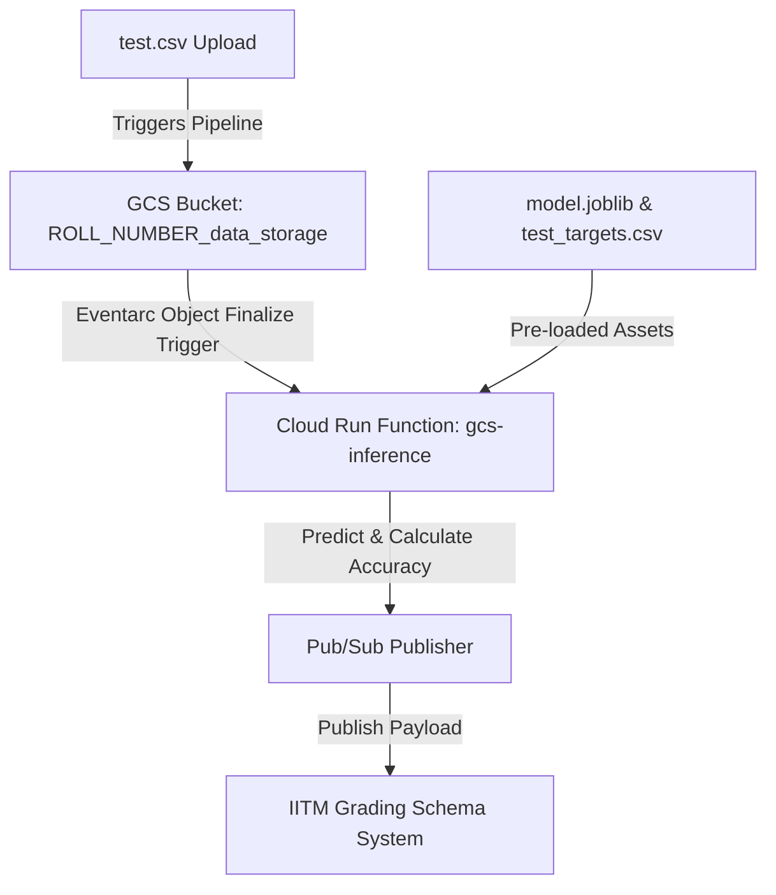

# 🎓 IITM GCP Day 2 ML Pipeline Workshop Helper

An interactive, high-fidelity 3D helper portal built with **Next.js (App Router)**, **TypeScript**, and **Three.js** to help IITM students seamlessly deploy, troubleshoot, and master their Day 2 Machine Learning pipelines on Google Cloud Platform. 

This portal is designed to eliminate common sandboxed roadblocks, dynamically generate compliant project assets, and offer instant, guardrailed AI tutoring.

🔗 **Live Deployed Website:** [https://iitm-workshop.vercel.app/](https://iitm-workshop.vercel.app/)

---

## 🚀 How This Website Helps Others

This website is a complete visual and educational playground specifically engineered to guide students through the complexities of GCP configurations. Here is exactly how this platform solves common student frustrations and boosts learning:

### 1. 🤖 Gemini-Inspired Academic AI Mentor
Stuck students don't need to sift through hundreds of Slack threads or Discord messages. The website features an ultra-clean, minimalist **Gemini-Style AI Mentor** centered directly on screen:
- **Instant Issue Recommendations:** The startup screen presents a centered 2x2 grid of recommendation cards corresponding to the top four pipeline pitfalls. Clicking any card automatically launches custom troubleshooting context.
- **Natural Language Debugging:** Students can copy-paste raw Cloud Build logs, deployment exceptions, or Eventarc triggers directly into the input bar.
- **Pedagogical Guardrails:** In line with academic guidelines, the AI is programmed to act as a **support scaffold**. It points out logical fallacies and conceptual fixes rather than providing raw, copy-pasteable solutions, guaranteeing that students actually learn.
- **Real-Time Security Auditing:** Students can expand the `Inspect RAG Guardrail Logs` inline dropdown under any AI message bubble to see exactly how their query was parsed through the 3-layer security architecture (Programmatic Filtering, Vector DB Chunk Hits, and System Persona Rules).

### 2. ⚡ Dynamic Code & Requirements Generator
Manual code copying often leads to transcription typos or spelling discrepancies. 
- **Roll-Customized Templates:** By simply entering their Roll Number (e.g., `24F2001627`), the portal instantly compiles a fully-compliant `main.py` and `requirements.txt`.
- **One-Click Package:** Instantly packages the custom code, requirements, and the standard `test.csv` training dataset for immediate download.

### 3. 🌐 Interactive 3D Architecture Visualizer
Embedded on the page is a responsive **WebGL Three.js Canvas** that renders orbiting wireframe node rings. This helps students visualize the dynamic GCP Pub/Sub and Eventarc data channels:
- Hovering or moving the mouse rotates the orbit, illustrating how events propagate from Google Cloud Storage to Cloud Run.

### 4. 🚀 Session-Aware Onboarding Dialog
When a student lands on the website for the first time, a premium glassmorphic modal automatically welcomes them, explains the Day 2 ML Pipeline objectives, highlights sandbox quota limitations, and invites them to initialize the AI Mentor.

---

## 🛠️ GCP Day 2 ML Pipeline Architecture

The workshop pipeline coordinates as follows:



1. **Cloud Storage Bucket:** Staged in `us-central1` (Iowa) with the exact naming convention `<ROLL_NUMBER>_data_storage` (lowercase).
2. **Pre-loaded Helper Assets:** `model.joblib` and `test_targets.csv` loaded into GCS.
3. **Cloud Run Function (`gcs-inference`):** Python 3.12 function running in `us-central1` that downloads `test.csv` on upload, performs model inference, calculates accuracy, and publishes a Pub/Sub payload.
4. **IITM Grading Bot:** Listens for the Pub/Sub payload, validates results, and triggers a G-Space Chat verification message.

---

## 🔒 The 3-Layer RAG Guardrail System

The AI Chatbot employs a state-of-the-art **Retrieval-Augmented Generation (RAG)** pipeline to remain secure, off-topic guarded, and academically compliant:

```text
┌─────────────────────────────────────────────────────────┐
│              [Student Query / Log Paste]                │
└────────────────────────────┬────────────────────────────┘
                             │
            Layer 3: Programmatic Classifier
            - Checks query against off-topic keywords
            - Blocks bake recipes, history, general text
                             │
                             ▼
            Layer 2: Simulated Vector RAG Hit
            - Runs lexical semantic match on query keywords
            - Retrieves targeted context from knowledge base
                             │
                             ▼
            Layer 1: System Prompt Constraints
            - Injects Retrieved Context + Mentor Prompt
            - Fires to Llama-3-8B Serverless Inference API
```

- **Layer 3 (Gateway Classifier):** Blocks prompt injections and off-topic requests (e.g., cooking recipes or general writing) instantly at the edge.
- **Layer 2 (Lexical Vector RAG):** Matches keyword arrays against our structured indexing system to pull precise context blocks for scikit-learn build issues, quota limits, casing rules, or Eventarc delays.
- **Layer 1 (Llama-3-8B Inference):** Passes the injected context and system persona to the serverless model via Hugging Face.

---

## ⚠️ Sandboxed Student Environment Troubleshooting (Crucial)

If you or your classmates are facing issues, review these common roadblocks and their fixes:

### 1. Case-Sensitivity Issue (Silent Bot Failures)
* **Problem:** The automated IITM grading system is strictly **case-sensitive** for roll numbers. If your bucket name, Cloud Run configuration, or Pub/Sub payload uses a lowercase 'f' (e.g., `25f3001012`), the grading bot fails silently and ignores the submission.
* **Fix:** Ensure you always use an uppercase **`F`** (e.g. `25F3001012`) inside the `roll` string variable inside your Python code. GCS bucket names must remain lowercase.

### 2. Quota Exceeded / Failed to Initialize Region Error
* **Problem:** Sandboxed GCP student accounts are restricted exclusively to the **`us-central1` (Iowa)** region. Trying to deploy in other regions will fail with a `Quota Exceeded` error.
* **Fix:** Recreate both the bucket and Cloud Run Function, ensuring the region configuration is manually set to **`us-central1`**.

### 3. Pub/Sub Message Schema Validation Failure
* **Problem:** The grading schema server expects the `accuracy` payload parameter to be formatted strictly as a string (e.g., `"0.85"`), and will throw a validation error if sent as a raw float/number (e.g., `0.85`).
* **Fix:** Ensure accuracy is explicitly cast to a string via `str(accuracy)` before constructing the JSON payload.

### 4. Eventarc Service Agent Propagation Lag
* **Problem:** When setting up a GCS trigger for the first time, Cloud Run triggers might not fire immediately due to IAM sync delays (which can take 2–10 minutes).
* **Fix:** Wait 5 minutes, then go to your bucket and re-upload `test.csv` (using the "Overwrite object" option) to re-trigger.

---

## 💻 Local Development Setup

To run or modify the helper website locally:

### Prerequisites
- **Node.js** v18.0.0 or higher
- **npm**, **yarn**, or **pnpm**

### Step-by-Step Installation

1. **Clone the repository:**
   ```bash
   git clone https://github.com/aryanRN2/workshop-helper.git
   cd workshop-helper
   ```

2. **Install package dependencies:**
   ```bash
   npm install
   ```

3. **Configure Environment Secrets:**
   Create a `.env.local` file in the root directory and add your free Hugging Face API Token (used to call Llama 3):
   ```text
   HF_TOKEN=your_hugging_face_token_here
   ```
   *Note: If no HF token is supplied, the AI workspace gracefully falls back to a highly accurate local simulator, making it easy to test offline!*

4. **Start the local development server:**
   ```bash
   npm run dev
   ```
   - Open [http://localhost:3000](http://localhost:3000) in your web browser.

5. **Compile for production:**
   Run checks for ESLint rules, TypeScript verification, and build optimized production chunks:
   ```bash
   npm run build
   ```

---

## 🌟 Tech Stack

- **Next.js 16** (App Router & Dynamic Serverless Routes)
- **React 19**
- **Three.js** (WebGL 3D Orbiting Canvas Background)
- **TypeScript** (Strict Type Safety)
- **TailwindCSS** (High-fidelity Responsive Glassmorphism Styling)
- **Lucide React** (Vector Icons)

---

## 👨‍💻 Author & Contact

Created with 💙 to support fellow IITM students. 

- **Developer:** Aryan Maurya
- **Portfolio:** [https://me-aryan.vercel.app](https://me-aryan.vercel.app)
- **GitHub Repository:** [workshop-helper](https://github.com/aryanRN2/workshop-helper)

***

Feel free to fork this project, open issues, or recommend enhancements to improve the learning journey of our batch! 🚀
